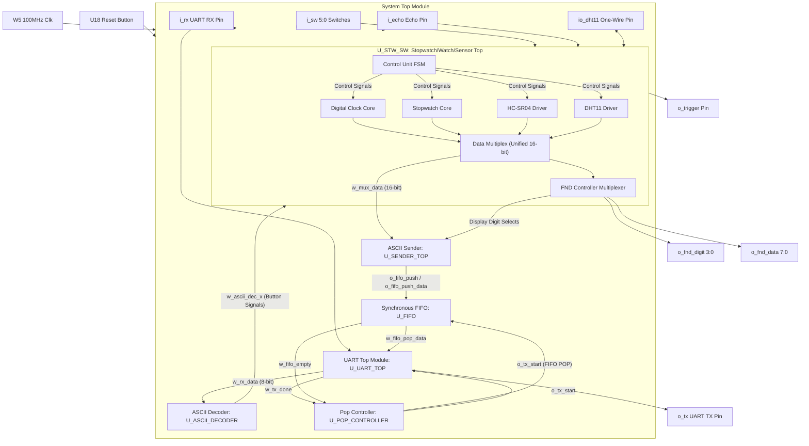

# FPGA Integrated Control System: Watch, Environment Sensors & UART with FIFO Buffer

## 1. Project Overview
본 프로젝트는 AMD Artix-7 기반의 Basys 3 FPGA 보드를 핵심 타겟으로 하여, 디지털 시계/스톱워치 코어 로직에 
초음파 및 온습도 센서 제어 인터페이스를 통합한 임베디드 통합 관제 시스템(Integrated Control System) 설계입니다.

단순히 독립된 기능들을 나열하는 것에 그치지 않고, 각 모듈간의 데이터 버스를 통합하는 Data Routing 아키텍처를 설계했습니다. 
특히 시스템 클럭(100MHz)과 UART 직렬 통신(9600bps) 간의 극심한 클럭 도메인 차이로 발생하는 데이터 병목 및 유실 문제를 해결하기 위해, 
내부 하드웨어 FIFO(First-In, First-Out) 버퍼와 전용 Pop Controller를 직접 설계하여 데이터 무결성을 검증했습니다.

## 2. System Specification & Environment
| Category | Details |
| :--- | :--- |
| Target Hardware | AMD Artix-7 FPGA (Basys 3 Development Board) |
| EDA Tools | Xilinx Vivado 2020.2, VS Code |
| Hardware Language| Verilog HDL (Gate-level & Behavioral Modeling) |
| Peripherals | HC-SR04 (Ultrasonic), DHT11 (Temp/Humidity), 4-Digit 7-Segment (FND) |
| Interface Protocol| UART (9600 bps, 8-N-1 Configuration), 1-Wire Bidirectional Protocol |

## 3. Advanced Hardware Architecture & Module Details

전체 시스템은 모듈러 설계(Modular Design) 원칙에 따라 기능별로 완전히 격리된 하위 모듈로 설계되었으며, 최상위 모듈(`top.v`)에서 유기적으로 인터페이싱됩니다.

### 3.1. Sensor Control & Protocol Interface
* `dht11.v` (온습도 센서 제어 유닛)


    * Bidirectional I/O Control: 단일 핀(`inout`)을 시분할하여 FPGA가 마스터로서 Start Signal(최소 18ms Low)을 드라이브한 후,
      즉시 수신 모드(High-Z 플로팅)로 전환하는 삼상 버퍼(Tri-state Buffer) 로직 구현.
    * Time-to-Data Decoding: 1us 단위의 정밀 타이머(`tick_gen_1us`)를 기반으로, 센서가 응답하는 하이 펄스의
      유지 시간(26~28us: 데이터 '0' / 70us: 데이터 '1')을 계측하여 40-bit 데이터 스트림을 에러 없이 복원하는 FSM 설계.

* `sr04.v` (초음파 거리 측정 유닛)


    * Time of Flight (ToF) 계측: 센서 트리거 조건인 10us의 High 펄스를 정밀 인가한 후,
      돌아오는 Echo 신호의 High 유지 시간을 카운트하여 센서와 물체 간의 물리적 거리를 계산.

### 3.2. Async Data Buffering & Serial Communication


* `fifo.v` (하드웨어 큐 버퍼)
    * Dual-Port Register Array: 16바이트 깊이(Depth 16, Width 8-bit)의 레지스터 어레이를 기반으로 순환 큐(Circular Queue) 구조의 FIFO 설계.
    * Status Flag Generation: Write Pointer와 Read Pointer의 상대적 위치 비교 및 동기 연산을 통해
      데이터 오버플로우를 방지하는 `o_full` 신호와 언더플로우를 방지하는 `o_empty` 상태 플래그 생성 유닛 탑재.
* `pop_controller.v` & `sender_top.v`
    * Baud Rate Synchronization: 100MHz 클럭 도메인에서 생성된 센서 및 시간 데이터(Binary)를 10진수 문자로 분리하고 ASCII 코드(`+ 8'h30`)로 인코딩하여 FIFO에 Push.
    * Tx Scheduling FSM: UART 송신 모듈의 상태(`tx_busy`, `tx_done`)를 핸드셰이킹(Handshaking)하여,
    * FIFO에 데이터가 존재하고 Tx가 Idle일 때만 1바이트씩 안전하게 빼내어(`Pop`) 송신 레이트를 제어하는 중재 로직 구현.
* `uart_top.v` (`uart_rx.v` / `uart_tx.v`)
    * 9600 bps 통신의 안정성을 확보하기 위해 `baud_tick` 모듈에서 16배수 오버샘플링(153,600Hz Tick)을 수행하여 비트의 중앙값(Center Sampling)을 추출함으로써 노이즈 마진 극대화.

### 3.3. Core Datapath & Human Interface
* `control_unit.v` (중앙 제어 FSM)
    * `STOP`, `RUN`, `CLEAR`의 기본 동작 모드와 시계 세팅을 위한 상/하/좌/우 상태 머신 구성.
    * 6-bit 제어 버스(`i_mode`) 입력을 통해 로컬 물리 스위치와 UART 원격 명령의 원격 스위칭을 동시 수용.
* `fnd_controller.v` (Time Division Multiplexing 디스플레이)
    * 4자리의 FND 잔상 효과(Persistence of Vision)를 이용하기 위해 1kHz 클럭 분주기를 구현하고,
    * 상위 스위칭 데이터 선택 프로토콜에 따라 시계(`시:분` 또는 `초:밀리초`), 거리 데이터, 온습도 데이터를 선택적으로 라우팅하여 출력 레디오 최적화.

## 전체 시스템 아키텍처 계층 구조 (Top-Down Block Diagram)


## 4. System Register & Control Mapping
보드의 스위치(`sw`) 설정에 따라 FND에 디스플레이되는 데이터와 UART를 통해 PC로 송신되는 데이터 패스가 동기화되어 매핑됩니다.

| `sw[1:0]` 상태 | 활성화 모드 (Mode) | FND 출력 데이터 포맷 | PC 터미널 송신 데이터 예시 |
| :--- | :--- | :--- | :--- |
| `2'b00` | 디지털 시계 (Watch) | `시 : 분` 또는 `초 : 밀리초` (sw[2] 전환) | `[TIME] 23:59:59` |
| `2'b01` | 스톱워치 (Stopwatch)| `분 : 초` 및 밀리초 단위 연산 | `[STW] 01:23:45` |
| `2'b10` | 초음파 센서 (SR04) | 계측된 실시간 물체 거리 ($cm$) | `[DIST] 15 cm` |
| `2'b11` | 온습도 센서 (DHT11)| 현재 환경 온도($^\circ C$) 및 습도($\%$) | `[ENV] T:26C H:45%` |

## 5. 동작 영상


## 6. In-System Debugging & Trouble Shooting
본 프로젝트에서 가장 고도화된 하드웨어 디버깅 경험은 비동기 통신 간의 데이터 유실(Data Drop) 이슈를 칩 내부 레벨에서 분석하고 해결한 것입니다.

* 문제 정의 (Symptom): 센서 계측 결과 문자열을 UART를 통해 PC 터미널로 연속 전송 시, 특정 바이트가 유실되거나 깨지는 현상 발생. 
* 원인 분석 (Root Cause Analysis via ILA): 
    * Vivado의 내부 로직 분석기 코어인 ILA(Integrated Logic Analyzer)를 하드웨어에 설계 삽입하여 시뮬레이션으로 잡히지 않는 실제 타이밍 포착.
    * 분석 결과, 센서 데이터를 ASCII 문자열로 디코딩하여 전송 요청 신호(`tx_start`)를 주는 속도가 UART 송신부 회로가 1바이트를 실제로 라인에 밀어내는 전송 완료 속도(`tx_done`)보다 빨라,
    * 이전 데이터가 채 전송되기 전에 다음 데이터가 덮어씌워지는(Overwrite) 병목 타이밍 발견.
* 해결 방안 및 검증 (Resolution): 
    * 속도 차이를 완충하기 위해 전송 데이터를 일시 보관할 수 있는 8-bit 하드웨어 FIFO 버퍼를 설계 및 도입.
    * 버퍼의 상태를 감시하여 TX가 확실히 비어 있을(`Idle`) 때만 다음 데이터를 팝업해 주는 전용 헨드셰이킹 제어기(`pop_controller`)를 설계 구조에 추가.
    * 수정 후 ILA 시그널 디버깅을 재수행하여 `tx_start`와 `tx_busy`가 완벽하게 인터락킹(Interlocking)되어 데이터 유실율 0%의 안정적인 스트리밍이 이루어짐을 검증 완료.

## 7. Team & Presentation Information
* Project Team: 온디바이스 AI 시스템반도체 설계 1기 4조 (강동우, 문태성, 서어진, 안정현)
* Core Role: 시스템 통합 최상위 모듈 설계, UART 직렬 통신 컨트롤러 및 하드웨어 FIFO 버퍼 아키텍처 설계, ILA 기반 하드웨어 디버깅 및 트러블슈팅 주도.

# 🕒 Basys 3 기반 디지털 시계/스톱워치 & 온습도·초음파 센서 통합 시스템 (UART + FIFO 제어 및 SystemVerilog 검증)

AMD Artix™-7 (Basys 3) FPGA 보드를 활용하여 **디지털 시계(Watch), 스톱워치(Stopwatch), DHT11 온습도 센서, HC-SR04 초음파 센서**를 통합 구동하는 SoC 설계 프로젝트입니다.  
동기식 FIFO 버퍼와 UART IP를 직접 설계하여 보드의 계측 데이터를 PC로 모니터링하고 PC 키보드 입력(ASCII)을 통해 시스템을 원격 제어할 수 있습니다. 또한, **SystemVerilog 기반 UVM-style Verification Environment**를 구축하여 모든 기능 블록의 시뮬레이션 및 검증을 완료하였습니다.

---

## 🛠️ 개발 환경 & 사용 기술

| 분류 | 항목 | 세부 사양 / 도구 |
| :--- | :--- | :--- |
| **Hardware** | FPGA Board | AMD Xilinx Basys 3 (Artix-7 XC7A35T-1CPG236C) |
| **Software** | IDE / Toolchain | Vivado Design Suite 2020.2 |
| | Text Editor | VS Code |
| **Language** | Design | Verilog HDL |
| | Verification | SystemVerilog |
| **Debugging** | H/W Debugger | Vivado Integrated Logic Analyzer (ILA) |
| | Simulation | Vivado Simulator / ModelSim |

---

## 🗂️ 프로젝트 디렉터리 구조
```text
team_project_watch_stopwatch_uart_sensor/
├── README.md                                # 프로젝트 설명서 (본 파일)
├── team_project_watch_stopwatch_uart_sensor.xpr # Vivado 프로젝트 파일
├── images/                                  # 발표 자료에서 추출한 설계 및 검증 이미지 리소스
└── team_project_watch_stopwatch_uart_sensor.srcs/
    ├── constrs_1/
    │   └── imports/
    │       └── const/
    │           └── Basys-3-Master.xdc       # Basys 3 FPGA 핀 맵 매핑 파일
    ├── sim_1/
    │   └── new/                             # SystemVerilog 검증 소스 코드
    │       ├── tb_fifo_sv.sv                # FIFO 단독 동작 및 Full/Empty 강제 생성 테스트벤치
    │       ├── tb_rx_decoder_sv.sv          # UART RX 및 아스크 디코더 통합 검증
    │       ├── tb_sender_top_sv.sv          # ASCII Sender 데이터 가공 검증
    │       ├── tb_sender_fifo_uart_sv.sv    # Sender + FIFO + UART TX 토탈 송신 패스 검증
    │       └── tb_uart_fifo_sv.sv           # UART 컨트롤러와 FIFO의 연동 테스트
    └── sources_1/
        └── imports/
            └── imports/
                ├── 20260221_top/
                │   └── sender_top.v
                └── source/                  # RTL 설계 소스 코드
                    ├── sender/
                    │   ├── fifo.v           # 16-deep Synchronous FIFO 버퍼
                    │   ├── pop_controller.v # FIFO-UART TX 연동 팝 컨트롤러 FSM
                    │   └── sender_top.v     # BCD 데이터를 아스키 문자로 변환하여 FIFO에 적재
                    ├── sensor/
                    │   ├── dht11.v          # DHT11 온습도 센서 원와이어 통신 및 디코더
                    │   └── sr04.v           # HC-SR04 초음파 에코 시간 측정 및 거리 변환기
                    ├── uart/
                    │   ├── atscii2dec.v     # 수신된 아스키 입력을 스위치/버튼 펄스로 디코딩
                    │   ├── baud_tick.v      # 9600 bps 전송 속도 맞춤용 보레이트 제너레이터
                    │   ├── uart_rx.v        # UART Receiver
                    │   ├── uart_tx.v        # UART Transmitter
                    │   ├── uart_top.v       # UART RX, TX, Baud_tick 탑 모듈
                    │   └── top.v            # 전체 시스템 최상위 모듈 (System Top)
                    └── watch/
                        ├── btn_debounce.v   # 물리 버튼 채터링 방지용 디바운서
                        ├── control_unit.v   # 메인 제어 FSM (모드 전환 및 시간 조절)
                        ├── fnd_controller.v # 4자리 7-Segment 스캔 멀티플렉서 (BCD-to-FND 디코더 내장)
                        ├── tick_gen.v       # 스톱워치용 정밀 틱 제너레이터
                        ├── tick_gen_watch.v # 시계 동작용 1초 틱 제너레이터
                        ├── tick_cnt.v       # 스톱워치 카운터
                        ├── tick_cnt_watch.v # 시계 카운터 (시/분/초)
                        ├── top_watch.v      # 디지털 시계 서브 시스템 탑
                        ├── top_stopwathch.v # 스톱워치 서브 시스템 탑
                        └── top_stopwatch_watch.v # 시계, 스톱워치, 센서, FND 제어기 통합 데이터 탑
```

---

## 📐 시스템 아키텍처 (System Architecture)

전체 시스템은 **센서 계측 블록(DATA_TOP)**과 **시리얼 전송 및 원격 제어 블록(UART_TOP)**으로 이원화되어 유기적으로 연동됩니다.



---

## 🌟 핵심 기능 및 모드 설정 명세

### 1. 시스템 동작 모드 설정 (sw[1:0])
시스템의 전체 계측 기능 모드는 보드상의 슬라이드 스위치 `sw[1:0]`을 조합하여 결정됩니다.

| sw[1] | sw[0] | 동작 모드 | 주요 설명 및 제어 내용 |
| :---: | :---: | :--- | :--- |
| `0` | `0` | **디지털 시계 (Watch)** | 실시간 디지털 클럭 구동 및 자릿수별 개별 시간 조절 지원 |
| `0` | `1` | **스톱워치 (Stopwatch)** | 10ms(0.01초) 단위 정밀 시간 누적 측정 및 Up/Down 제어 |
| `1` | `0` | **초음파 센서 (SR04)** | HC-SR04 초음파 모듈을 활성화하여 물체와의 거리 측정 (cm) |
| `1` | `1` | **온습도 센서 (DHT11)** | DHT11 모듈과의 1-Wire 통신을 활성화하여 온도/습도 측정 |

### 2. 하드웨어 세부 제어 스위치 설정
기타 스위치를 통해 동작 중인 모드의 세부 표시 및 연산 방향을 제어할 수 있습니다.

| 스위치 명 | 설정값 | 동작 및 기능 설명 |
| :--- | :---: | :--- |
| **sw[2]** (FND 자릿수 표시 전환) | `1` | 시계 및 스톱워치 모드 시 디스플레이에 **시(Hour) - 분(Minute)** 데이터 표시 |
| | `0` | 시계 및 스톱워치 모드 시 디스플레이에 **초(Second) - 밀리초(msec)** 데이터 표시 |
| **sw[3]** (스톱워치 방향) | `1` | 스톱워치를 **Down-counter (카운트 다운)** 모드로 가동 |
| | `0` | 스톱워치를 **Up-counter (카운트 업)** 모드로 가동 |
| **sw[4]** (시계 설정 모드 활성) | `1` | **시간 수정 모드 진입** (수정할 자리 펄스 대기 및 Up/Down 버튼 활성화) |
| | `0` | 일반 시계 시간 흐름 주행 상태 |
| **sw[5]** (DHT11 출력 데이터 선택) | `1` | FND 디스플레이에 계측된 **온도(Temperature)** 데이터 출력 |
| | `0` | FND 디스플레이에 계측된 **습도(Humidity)** 데이터 출력 |

### 3. PC 시리얼 키보드 원격 제어 (UART RX ASCII Key Map)
PC 터미널(예: ComPortMaster 등)에서 아스키 입력을 전송하면, 내부 `ascii_decoder`에서 FPGA의 특정 물리 버튼 제어 펄스로 매핑/변환하여 보드를 터치하지 않고 키보드로 원격 제어할 수 있습니다.

| 키보드 입력 키 | 디코딩 펄스 신호 | 시계 모드 (`sw[1:0]=2'b00`) | 스톱워치 모드 (`sw[1:0]=2'b01`) | 센서 모드 (`2'b10`, `2'b11`) |
| :---: | :--- | :--- | :--- | :--- |
| **`r`** | `o_btn_r` (물리 버튼 우측) | 시간 변경 모드 시 수정 자릿수 **우측 이동** | 스톱워치 **RUN / STOP** 제어 | 센서 계측 **START** |
| **`l`** | `o_btn_l` (물리 버튼 좌측) | 시간 변경 모드 시 수정 자릿수 **좌측 이동** | 스톱워치 **CLEAR (리셋)** | - |
| **`u`** | `o_btn_u` (물리 버튼 위쪽) | 선택된 자릿수 값 **1 증가 (UP)** | - | - |
| **`d`** | `o_btn_d` (물리 버튼 아래쪽) | 선택된 자릿수 값 **1 감소 (DOWN)** | - | - |
| **`s`** | `o_btn_s` | - | - | **UART 전송 지시** (계측 데이터 FIFO Push) |
| **`0` ~ `5`** | `o_btn_0` ~ `o_btn_5` | 수정할 특정 자릿수로 **다이렉트 이동** | - | - |

### 4. UART 데이터 송신 메시지 규격
시스템 데이터가 ASCII Sender를 통해 UART TX 핀으로 전달될 때, 각 제어 조건에 부합하는 문자열 형태로 가공되어 FIFO 버퍼에 적재됩니다.

| 타겟 모드 | i_sel (2진수) | i_sel_2[1] (h/m, s/ms) | i_sel_2[0] (temp/humid) | 전송 문자열 규격 (LF 포함) | 터미널 출력 예시 |
| :--- | :---: | :---: | :---: | :--- | :--- |
| **시계 (sec/ms)** | `2'b00` | `0` | `?` | `time=XXsXXms\n` | `time=23s48ms` |
| **시계 (hour/min)** | `2'b00` | `1` | `?` | `time=XXhXXm\n` | `time=09h15m` |
| **스톱워치 (sec/ms)** | `2'b01` | `0` | `?` | `stop_time=XXsXXms\n` | `stop_time=12s04ms` |
| **스톱워치 (hour/min)** | `2'b01` | `1` | `?` | `stop_time=XXhXXm\n` | `stop_time=00h02m` |
| **초음파 거리 측정** | `2'b10` | `?` | `?` | `distance=XXXX.Xcm\n` | `distance=024.8cm` |
| **DHT11 온도 측정** | `2'b11` | `?` | `0` | `temp=XX.XXC\n` | `temp=24.50C` |
| **DHT11 습도 측정** | `2'b11` | `?` | `1` | `humid=XX.XX\n` | `humid=48.00` |

---

## 📦 모듈 리스트 및 아키텍처 요약

### 1. RTL 설계 모듈 요약 (RTL Modules Summary)

| 구분 | 모듈명 (Module Name) | 소스 파일 경로 | 주요 역할 및 설명 |
| :---: | :--- | :--- | :--- |
| **Top** | `top` | `uart/top.v` | 시스템 최상위 모듈. 데이터 가공 패스와 UART 인터페이스 연동 총괄 |
| **Control** | `control_unit` | `watch/control_unit.v` | 메인 FSM 제어기 (상태 관리 및 시계 수정 조절 신호 발생) |
| | `btn_debounce` | `watch/btn_debounce.v` | 물리 푸시 버튼 입력의 채터링 노이즈 제거용 클럭 카운팅 디바운서 |
| **Watch** | `top_watch` | `watch/top_watch.v` | 시계 데이터 카운팅 연산부 (시/분/초 레지스터 계측 제어) |
| | `tick_gen_watch` | `watch/tick_gen_watch.v` | 시스템 클럭(100MHz)을 1초 주기로 디바이드하는 생성기 |
| | `tick_cnt_watch` | `watch/tick_cnt_watch.v` | 자릿수별 자원 한계값(9, 5, 2 등)에 대응하는 BCD 카운터 |
| **Stopwatch** | `top_stopwathch` | `watch/top_stopwathch.v` | 스톱워치 서브 시스템 탑 (RUN, STOP, CLEAR, Up/Down 로직 결합) |
| | `tick_gen` | `watch/tick_gen.v` | 스톱워치 계측 주기(10ms)에 부합하는 클럭 디바이드 틱 제너레이터 |
| | `tick_cnt` | `watch/tick_cnt.v` | 스톱워치 누적 연산용 BCD 카운터 모듈 |
| **Display** | `fnd_controller` | `watch/fnd_controller.v` | 4자리 7-Segment 스캔 구동 및 BCD 데이터를 FND LED 신호로 디코딩 |
| **Sensors** | `top_sr04` | `sensor/sr04.v` | 초음파 센서 거리 연산부. 5.8us 틱 기반 Echo 하이 타임 거리 환산 |
| | `dht11_top` | `sensor/dht11.v` | DHT11 온습도 센서 제어 탑 모듈. 양방향 1-Wire FSM 40비트 분석 |
| **UART** | `uart_top` | `uart/uart_top.v` | UART 통신 제어 탑 모듈 (Baud rate 및 RX, TX 제어) |
| | `baud_tick` | `uart/baud_tick.v` | 9600 bps 전송 기준점에 부합하는 내부 샘플링 보레이트 틱 발진기 |
| | `uart_rx` | `uart/uart_rx.v` | 8-bit 데이터 단위 직렬-병렬 UART 수신 모듈 |
| | `uart_tx` | `uart/uart_tx.v` | Start/Stop 비트 동기 신호 삽입 기반 병렬-직렬 UART 송신 모듈 |
| | `ascii_decoder` | `uart/atscii2dec.v` | RX 완료된 문자 코드를 버튼 제어 및 펄스 조작 라인으로 분배 디코딩 |
| **Buffer** | `sender_top` | `sender/sender_top.v` | 계측 BCD 데이터를 아스키 캐릭터 코드로 실시간 변환 및 패킷 구성 |
| | `fifo` | `sender/fifo.v` | 송신측 속도차를 격리 완충하여 손실을 방지하는 16-deep 동기식 FIFO 버퍼 |
| | `pop_controller`| `sender/pop_controller.v` | UART TX 상태에 맞추어 FIFO의 POP 신호를 지시/관리하는 컨트롤러 |

### 2. SystemVerilog 검증 컴포넌트 요약 (SystemVerilog Testbenches)

| 검증 테스트벤치 파일명 | 타겟 설계 모듈 (DUT) | 검증 시나리오 및 기법 요약 |
| :--- | :--- | :--- |
| **`tb_fifo_sv.sv`** | `fifo` | **버퍼 격리 검증:** FIFO가 가득 찼을 때(`o_full`)와 비었을 때(`o_empty`) 포인터의 롤오버 경계와 동작 제어가 정상인지, 연속적인 Push/Pop 루프를 통해 모니터링 |
| **`tb_rx_decoder_sv.sv`** | `uart_rx` + `ascii_decoder` | **아스키 디코딩 제어 검증:** 시리얼 가상 신호선을 구동하여 원격 PC 명령 캐릭터들을 보냈을 때, 대응하는 디코딩 버튼 라인이 정확히 활성화되는지 Scoreboard 연동 비교 검증 |
| **`tb_sender_top_sv.sv`** | `sender_top` | **아스키 텍스트 생성 검증:** 무작위 BCD 데이터 및 설정 스위치 조합을 생성 인입하고, 이에 상응하는 출력 아스키 문자 메시지 레코드가 규격에 부합하는지 클래스식 감시 |
| **`tb_sender_fifo_uart_sv.sv`**| `sender_top` + `fifo` + `uart_top` | **종단간(End-to-End) 송신 정합성 검증:** 송신 전 구간 통합 시뮬레이션을 구현하여, 임의 계측 결과가 UART TX 핀을 타고 최종 복원되었을 때 데이터 손실 및 정렬 일치 여부 Scoreboard 검증 |
| **`tb_uart_fifo_sv.sv`** | `fifo` + `uart_top` | **레이트 완충 연동 검증:** FIFO POP 타이밍과 UART TX Busy 상태 신호가 정상적으로 레이트 완충 제어를 수행하는지 인터페이스 검사 |

---

## 🛠️ 주요 트러블슈팅 (Troubleshooting & Debugging)

| 문제 현상 (Issue Description) | 발생 원인 (Root Cause) | 해결 방안 (Resolution) |
| :--- | :--- | :--- |
| **FND 특정 자릿수 상수로 멈춤** | `tick_counter`의 틱 신호 `o_tick`이 순차 회로(`always @(posedge clk)`) 내부와 조합 회로(`assign`)에서 동시 구동되어 Multi-Source 충돌 유발 | 순차 회로 내의 `o_tick <= 0;` 구문을 완전히 소거하고 조합 회로 assign 블록에서만 단일하게 구동하도록 정리하여 틱 클럭 인입 타이밍 복구 |
| **초음파 센서 거리값 측정 시 계속 누적** | 센서 내부 카운터 레지스터가 시스템 글로벌 리셋(`rst`)에만 초기화되어 동작 버튼을 새로 누를 때마다 거리가 계속 합산됨 | FSM이 초음파 트리거 송출 직전 단계인 `START` 상태로 천이할 때 작동 카운터를 동기식으로 초기화하는 `clear` 로직을 추가하여 문제 해결 |
| **FIFO DEPTH 변경 시 버퍼 중단 및 High-Z** | FIFO 깊이 크기 파라미터를 2의 제곱수($2^n$)가 아닌 임의의 값(예: 17, 21)으로 수정하여 주소 포인터의 롤오버 경계가 불일치함 | FIFO 주소 회전 설계의 특징을 감안하여 깊이 크기를 $2^n$ 단위인 **`16`으로 엄격히 고정**하고 자동 오버플로우가 돌게끔 수정하여 오작동 원천 차단 |
| **UART 16바이트 전송 완료 후 가비지 문자 추가**| `sender_top` 내부 상태 머신 제어 한계 에러로 인해 데이터 송출이 끝나는 마지막 시점에 FIFO PUSH 펄스가 1클럭 더 발생하여 이전 버퍼 문자 추가 송출 | ILA 장비를 통하여 PUSH 신호 주기를 확인 후, `!FIFO_FULL` 조건과 문자 인덱스 한계값 검사 타이밍의 동기화 캡처 에지를 1클럭 앞당겨 조기 차단 조치 |

---

## 🎛️ Basys 3 보드 H/W Pin Constraints Map (Basys-3-Master.xdc)

| 신호 그룹 | 포트명 (Port Name) | 방향 (Direction) | Basys 3 Pin | 기능 설명 및 상세 내역 |
| :---: | :--- | :---: | :---: | :--- |
| **System** | `clk` | Input | **`W5`** | 100 MHz 보드 내장 메인 클럭 오실레이터 |
| | `rst` | Input | **`U18`** | 시스템 글로벌 리셋 (중앙 푸시 버튼) |
| **Switches** | `i_sw[0]` | Input | **`V17`** | 메인 시스템 모드 설정 LSB (sw[1:0]) |
| | `i_sw[1]` | Input | **`V16`** | 메인 시스템 모드 설정 MSB (sw[1:0]) |
| | `i_sw[2]` | Input | **`W16`** | FND 표시 형식 전환 (`1`: 시-분 / `0`: 초-ms) |
| | `i_sw[3]` | Input | **`W17`** | 스톱워치 카운트 방향 (`1`: Down / `0`: Up) |
| | `i_sw[4]` | Input | **`W15`** | 시계 설정 모드 활성화 스위치 (`1`: ON) |
| | `i_sw[5]` | Input | **`V15`** | DHT11 표기 선택 스위치 (`1`: 온도 / `0`: 습도) |
| **LEDs** | `o_data_sel[0]` | Output | **`U16`** | 현재 선택된 데이터 소스 표시 LSB (LED 0) |
| | `o_data_sel[1]` | Output | **`E19`** | 현재 선택된 데이터 소스 표시 MSB (LED 1) |
| | `o_cntl_5` | Output | **`U15`** | 상태 확인용 제어 모니터링 출력 LED (LED 5) |
| **FND Display**| `o_fnd_digit[0]` | Output | **`U2`** | 7-Segment Digit 1 활성화 (가장 오른쪽) |
| | `o_fnd_digit[1]` | Output | **`U4`** | 7-Segment Digit 2 활성화 |
| | `o_fnd_digit[2]` | Output | **`V4`** | 7-Segment Digit 3 활성화 |
| | `o_fnd_digit[3]` | Output | **`W4`** | 7-Segment Digit 4 활성화 (가장 왼쪽) |
| | `o_fnd_data[7]` | Output | **`V7`** | 7-Segment 소수점 (DP) 제어 |
| | `o_fnd_data[6:0]` | Output | **`U7` ~ `W7`**| 7-Segment LED segment a~g 제어 버스 라인 |
| **Buttons** | `i_btn_u` | Input | **`T18`** | 물리 버튼 위쪽 (Up) - 시계 수정 값 증가 |
| | `i_btn_d` | Input | **`U17`** | 물리 버튼 아래쪽 (Down) - 시계 수정 값 감소 |
| | `i_btn_l` | Input | **`W19`** | 물리 버튼 왼쪽 (Left) - 스톱워치 CLEAR / 시계 자리 왼쪽 이동 |
| | `i_btn_r` | Input | **`T17`** | 물리 버튼 오른쪽 (Right) - 스톱워치 RUN·STOP / 시계 자리 오른쪽 이동 |
| **Sensors** | `io_dht11` | Inout | **`G2`** | DHT11 온습도 센서 데이터 신호선 (Pmod JA4) |
| | `o_trigger` | Output | **`H2`** | HC-SR04 초음파 모듈 트리거 펄스 출력 (Pmod JA9) |
| | `i_echo` | Input | **`G3`** | HC-SR04 초음파 모듈 에코 펄스 수신 (Pmod JA10) |
| **UART Comm**| `i_rx` | Input | **`B18`** | FTDI USB-to-UART 직렬 수신 신호 (RX) |
| | `o_tx` | Output | **`A18`** | FTDI USB-to-UART 직렬 송신 신호 (TX) |

